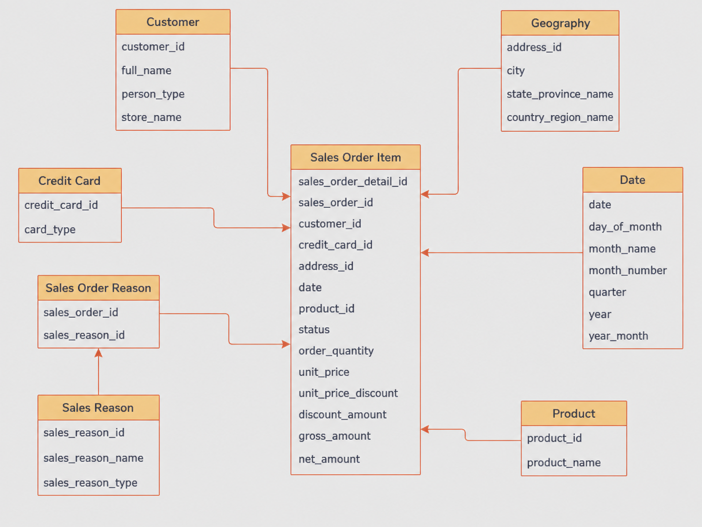

# Adventure Works Analytics Platform

A modern analytics platform built to transform Adventure Works transactional sales data into reliable, documented, and analytics-ready data products.

The project uses **dbt and Databricks** to implement a dimensional data warehouse designed around business questions related to sales performance, customers, products, geography, payment methods, and sales reasons.

The platform emphasizes **data quality, dimensional modeling, metric consistency, lineage, governance, and safe consumption by BI tools**.

---

## Live Dashboard

Explore the interactive Power BI dashboard:

[**View Live Dashboard →**](https://app.powerbi.com/view?r=eyJrIjoiN2ZlZGM5NjQtODZiNi00ODM4LTlmMTctZTQ5YTU1NDgwZTY0IiwidCI6ImZhZGU5M2Q1LTdlMGYtNDRiMi1hZjQzLTJhMmVmZDVhYjQzMCJ9)

> Interactive sales analytics covering sales performance, customers, geography, products, and sales reasons.


## Business Context

Adventure Works needs a reliable analytical foundation to support sales decision-making.

The platform was designed to answer questions such as:

* How many orders were placed and how many units were sold?
* How much gross and net revenue was generated?
* Which products generate the highest average ticket?
* Who are the highest-value customers?
* Which cities generate the most revenue?
* How do sales evolve over time?
* Which products sell the most when the sales reason is `Promotion`?

The analytical model also needs to support filtering and segmentation by:

* product;
* customer;
* sales date;
* credit card type;
* sales reason;
* order status;
* city;
* state;
* country.

---

## Business Questions & Analytical Coverage

The analytics platform supports the main sales questions required for decision-making across products, customers, geography, time, payment methods, order status, and sales reasons.

| Business Analysis | Analytical Capability |
|---|---|
| Sales performance | Orders, purchased quantity, gross sales, discounts, and net sales across the main business dimensions |
| Product performance | Product ranking and average ticket analysis by period and geography |
| Customer value | Top customers by negotiated sales value with multidimensional filtering |
| Geographic performance | City, state, and country analysis, including top-performing locations |
| Sales trends | Monthly and yearly evolution of orders, quantity, and sales value |
| Promotion analysis | Product performance specifically associated with the `Promotion` sales reason |

These analyses are delivered through an interactive Power BI dashboard backed by the governed dimensional marts.

---

## Selected Analytical Domain

The Adventure Works transactional database contains a much broader operational schema than the subset required for this sales analytics platform.

For this analytical product, the selected business entities were:

* sales orders;
* sales order items;
* products;
* customers;
* credit cards;
* sales reasons;
* addresses and geographic attributes.

These entities were selected because they directly support the required sales analyses across product, customer, time, payment method, sales reason, status, city, state, and country.

The analytical model was therefore designed around the sales process rather than reproducing the transactional schema as-is.

---

## Architecture

The analytics workflow follows a layered dbt architecture:

```text
Adventure Works Transactional Data
              │
              ▼
           Sources
              │
              ▼
           Staging
              │
              ▼
        Intermediate
              │
              ▼
      Dimensional Marts
              │
              ▼
      Power BI Dashboard

Governance & Observability:
dbt Contracts • Tests • Documentation • Lineage • Exposure
```

### Sources

Defines the raw Adventure Works tables used by the project and applies source-level documentation and data quality tests.

### Staging

Standardizes the source data while preserving its original grain.

Responsibilities include:

* column selection and renaming;
* data type normalization;
* string standardization;
* controlled value corrections;
* preparation of clean analytical inputs.

### Intermediate

Centralizes joins and reusable business transformations before publication.

This layer is also used to safely resolve relationships that could otherwise introduce **fanout or duplicated metrics**.

### Marts

Publishes the dimensional models consumed by Power BI and other analytical use cases.

The sales mart includes:

* `fct_sales`;
* `dim_product`;
* `dim_customer`;
* `dim_date`;
* `dim_credit_card`;
* `dim_address`;
* `dim_sales_reason`;
* `bridge_sales_order_reason`.

These published models are protected with **dbt contracts, data tests, and documented lineage** to provide a stable analytical interface for downstream consumption.

---

## Dimensional Model

The analytical model was designed from the Adventure Works transactional schema by selecting the entities required to support the sales business questions.

At its core, `fct_sales` represents one sales order item and connects directly to dimensions for products, customers, dates, credit card types, and geography. Sales reasons are associated separately through `bridge_sales_order_reason` to safely represent the many-to-many relationship at the sales order level.

The many-to-many relationship between sales orders and sales reasons is handled through `bridge_sales_order_reason`, preserving the sales fact grain and preventing metric duplication.



---

## Handling Many-to-Many Sales Reasons

A sales order can be associated with multiple sales reasons, which creates a many-to-many relationship and a potential fanout risk when combined with item-level sales metrics.

The model isolates this relationship through `bridge_sales_order_reason`, preserving the grain of `fct_sales` and preventing financial measures from being duplicated by direct joins.

Sales reason is therefore used for analytical association and filtering, while financial metrics remain anchored to the original sales fact grain.

---

## Core Metrics

The analytical layer uses consistent metric definitions across dbt models and Power BI.

| Metric | Definition |
|---|---|
| Number of Orders | Distinct count of sales orders |
| Purchased Quantity | Sum of order quantity |
| Gross Sales | Order quantity × unit price |
| Discount Amount | Gross sales × unit price discount |
| Net Sales | Gross sales − discount amount |
| Average Ticket | Net sales divided by distinct orders |

These definitions are kept consistent across the analytical pipeline to avoid conflicting business logic between transformation and BI layers.

---

## Data Quality

Data quality is treated as part of the analytical architecture rather than as a final validation step.

The platform includes:

* source tests;
* primary key tests;
* relationship tests;
* uniqueness and not-null validations;
* singular business-rule tests;
* fanout validation;
* reconciliation tests;
* dbt model contracts.

A model is not considered ready for consumption simply because it executes successfully.

Its grain, keys, relationships, metrics, tests, and downstream behavior must also be validated.

---

## Governance & Lineage

Published analytical models are governed through dbt features that protect their structure and make dependencies transparent.

The platform includes:

* enforced contracts on published marts;
* documented models and columns;
* tested relationships between facts, dimensions, and bridge models;
* lineage managed through `source()` and `ref()`;
* generated dbt Docs for model and dependency inspection;
* the `adventure_works_sales_dashboard` exposure connecting the Power BI analytical product to its upstream marts.

These controls help keep the dimensional layer stable, traceable, and safe for downstream analytical consumption.

---

## Financial Reconciliation

One of the key financial controls validates Adventure Works gross sales for **2011**.

Expected gross sales:

```text
$12,646,112.16
```

A dedicated dbt reconciliation test verifies that the analytical transformation reproduces this value from the underlying sales transactions.

This control helps ensure that transformations do not introduce:

* missing transactions;
* duplicated transactions;
* incorrect joins;
* incorrect metric calculations;
* unexpected changes in financial totals.

---

## Technology Stack

| Component       | Technology   |
| --------------- | ------------ |
| Data Warehouse  | Databricks   |
| Transformation  | dbt          |
| Development     | dbt Cloud    |
| Language        | SQL / Jinja  |
| Version Control | Git / GitHub |
| BI              | Power BI     |
| Documentation   | dbt Docs     |

---

## Repository Structure

```text
.
├── models/
│   ├── staging/
│   │   ├── sales/
│   │   ├── production/
│   │   └── person/
│   │
│   ├── intermediate/
│   │
│   └── marts/
│       ├── dimensions/
│       └── facts/
│
├── seeds/
├── tests/
├── macros/
├── docs/
├── assets/
├── dbt_project.yml
├── packages.yml
└── README.md
```

The repository is organized around the analytical transformation lifecycle, with separate layers for source standardization, business transformations, dimensional publication, testing, documentation, and delivery assets.

---

## Development Workflow

Changes are developed through a controlled Git workflow:

```text
Feature Branch
      ↓
Implementation
      ↓
dbt Build & Validation
      ↓
Commit
      ↓
Pull Request
      ↓
Merge
```

Branches are organized around cohesive development cycles or features, supporting traceability and controlled delivery of analytical changes.

---

## Validation

The analytical model was validated through a combination of structural, relational, and financial checks.

Key validation evidence includes:

* source profiling and data type validation;
* grain and cardinality analysis;
* join fanout checks;
* row-count reconciliation;
* relationship and primary key tests;
* financial reconciliation for 2011 gross sales;
* dbt contracts on published marts;
* successful full `dbt build` execution;
* generated dbt documentation and lineage inspection.

The final sales fact preserves the expected item-level grain across **121,317 sales items**.

---

## Analytics Consumption

The dimensional marts power an interactive Power BI dashboard designed for business exploration while keeping core metric definitions and modeling rules governed in the analytical layer.

### Sales Overview

Executive view of sales performance, including core KPIs, product performance, geographic rankings, and sales evolution over time.


### Customers & Geography

Customer and geographic analysis across cities, states, and countries, with multidimensional filtering.


### Products & Sales Reason

Product performance and sales reason analysis, including dedicated analysis for the `Promotion` sales reason.


The dashboard consumes the published dimensional marts and is registered in dbt through the `adventure_works_sales_dashboard` exposure, connecting the analytical product to its upstream lineage.

---

## Engineering Principles

The project follows a few core principles:

> Business process before fact table.

> Grain before joins.

> Cardinality before aggregation.

> Data quality before publication.

> One definition for each metric.

> No join is considered safe without fanout analysis.

These principles guide both modeling decisions and implementation choices throughout the platform.

---

## Delivered Analytics Product

The Adventure Works Analytics Platform is operational as an end-to-end analytical solution for the sales domain.

Delivered components include:

* source modeling and source-level testing;
* standardized staging models;
* intermediate transformations and relationship handling;
* dimensional marts for sales analysis;
* item-level sales fact modeling;
* customer, product, date, geography, payment, and sales reason dimensions;
* many-to-many sales reason modeling through a dedicated bridge;
* financial metric definitions and reconciliation controls;
* dbt contracts and data tests;
* generated dbt documentation and lineage;
* an interactive Power BI dashboard;
* dbt exposure connecting the dashboard to its upstream marts.

---

## Author

**Carla Lira Rodrigues**

Analytics Engineering • dbt • Databricks • SQL • Power BI
